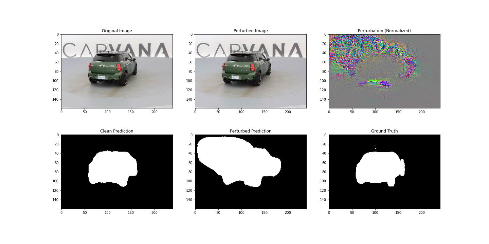

# DeepFool Attack on Medical Image Segmentation

## Table of Contents
1. [Introduction](#introduction)
2. [Key Features](#key-features)
3. [How It Works](#how-it-works)
4. [How to Use](#how-to-use)
5. [Results](#results)
6. [Comparison with UAP](#comparison-with-uap)
7. [Ethical Considerations](#ethical-considerations)
8. [Conclusion](#conclusion)

---

## Introduction <a name="introduction"></a>
This repository implements the DeepFool adversarial attack on a U-Net medical image segmentation model. Unlike Universal Adversarial Perturbations (UAP), DeepFool generates **input-specific perturbations** that exploit model decision boundaries to degrade segmentation performance.

### Key Differences from UAP
- **Input-Specific**: Unique perturbation for each image
- **No Pre-Training**: Perturbations generated on-the-fly
- **Smaller Magnitude**: Typically requires smaller ε values (0.02 vs UAP's 0.2)

---

## Key Features <a name="key-features"></a>
- 🎯 Targeted segmentation performance degradation
- 🖼️ Input-specific perturbation generation
- 📊 Quantitative evaluation (Dice score metrics)
- 📈 Qualitative visualization (comparison plots)
- ⚡ Optimized for medical image dimensions

---

## How It Works <a name="how-it-works"></a>
### Theoretical Basis
DeepFool finds the **minimal perturbation** needed to cross the model's decision boundary:
```math
argmin_{r} ||r||_2  \quad s.t. \quad f(x+r) ≠ f(x)
```
Adapted for segmentation tasks using:
1. Binary cross-entropy gradient calculations
2. Iterative perturbation refinement
3. Adaptive step size control

### Algorithm Steps
1. **Initialization**: Start with clean image
2. **Gradient Calculation**: Compute loss gradients
3. **Perturbation Update**: 
   ```python
   r_i = (loss + ε) * ∇/||∇||
   ```
4. **Early Stopping**: Exit when prediction changes
5. **Projection**: Clip to ε-ball constraint

---

## How to Use <a name="how-to-use"></a>

### Step-by-Step Guide
1. **Dataset Setup**
   ```bash
   /dataset/
     ├── train/
     ├── train_masks/
     ├── validation/
     └── validation_masks/
   ```

2. **Run Attack**
   ```python
   # Load pretrained U-Net
   model = torch.load('unet_complete_model.pth').to(device)
   
   # Initialize attack
   from deepfool_attack import run_deepfool_attack
   
   # Run on validation set
   attack_dice = run_deepfool_attack(
       model=model,
       val_loader=val_loader,
       save_dir='attack_results',
       max_iter=50,
       overshoot=0.02
   )
   ```

3. **View Results
   ```bash
   attack_results/
   ├── batch_0_sample_0.png
   ├── batch_0_sample_1.png
   ```

---

## Results <a name="results"></a>
### Example Output

*From left: Original Image, Perturbed Image, Perturbation Pattern, Clean Prediction, Perturbed Prediction, Ground Truth*

### Quantitative Metrics
| Metric              | Value |
|---------------------|-------|
| Clean Dice          | 0.9837 |
| Perturbed Dice      | 0.6758 |
| Performance Drop    | 0.3079 |

---
