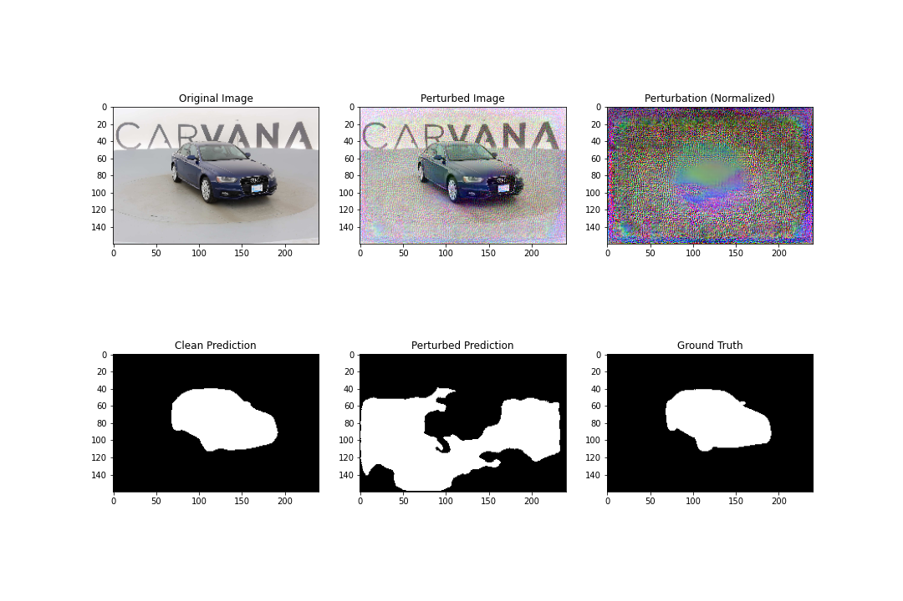

# Universal Adversarial Perturbation (UAP) Attack on U-Net Segmentation Model

## Table of Contents
- [Universal Adversarial Perturbation (UAP) Attack on U-Net Segmentation Model](#universal-adversarial-perturbation-uap-attack-on-u-net-segmentation-model)
  - [Table of Contents](#table-of-contents)
  - [Introduction ](#introduction-)
  - [What are UAP Attacks? ](#what-are-uap-attacks-)
  - [Code Overview ](#code-overview-)
  - [Implementation Details ](#implementation-details-)
  - [Results ](#results-)
  - [Conclusion ](#conclusion-)

## Introduction <a name="introduction"></a>

This project demonstrates Universal Adversarial Perturbation (UAP) attacks on a U-Net model trained for medical image segmentation. The attack generates a single perturbation pattern that degrades model performance across multiple input samples while remaining barely perceptible to human observers.

## What are UAP Attacks? <a name="what-are-uap-attacks"></a>

Universal Adversarial Perturbations are input-agnostic patterns that:
- Can fool neural networks when added to any input
- Work across multiple samples (universal)
- Require no knowledge of specific input data
- Maintain visual similarity to original inputs

## Code Overview <a name="code-overview"></a>

```python

# U-Net Architecture
class DoubleConv(nn.Module):
    def __init__(self, in_channels, out_channels):
        super().__init__()
        self.conv = nn.Sequential(
            nn.Conv2d(in_channels, out_channels, kernel_size=3, padding=1),
            nn.BatchNorm2d(out_channels),
            nn.ReLU(inplace=True),
            nn.Conv2d(out_channels, out_channels, kernel_size=3, padding=1),
            nn.BatchNorm2d(out_channels),
            nn.ReLU(inplace=True)
        )

class UNET(nn.Module):
    def __init__(self, in_channels=3, out_channels=1, features=[64, 128, 256, 512]):
        # Full U-Net implementation with encoder-decoder structure
```

```python

# UAP Training Loop
delta = torch.zeros((1, 3, H, W), requires_grad=True, device=device)
optimizer = torch.optim.SGD([delta], lr=0.1, momentum=0.9)

for epoch in range(num_epochs):
    perturbed_images = torch.clamp(images + delta, 0, 1)
    outputs = model(perturbed_images)
    loss = -criterion(outputs, masks)  # Maximize error
    loss.backward()
    optimizer.step()
    delta.data.clamp_(-epsilon, epsilon)
```

## Implementation Details <a name="implementation-details"></a>

- Input size: 160x240 pixels
- Batch size: 4:
  - Balances gradient diversity and memory constraints
  - small batches help maintain perturbation universality.
- Epsilon (ε): 0.2 (Empirically chosen)
- Training epochs: 7
- Learning rate: 0.1 (Empirically chosen)
- Momentum: 0.9 (Empirically chosen)
- Loss function: BCEWithLogitsLoss

## Results <a name="results"></a>

- Clean Dice Score: 0.9837
- Perturbed Dice Score: 0.3263
- Performance Drop: 65.74%

**Visual Results** (samples in `UAP_attack_images/`):


*Left to right: Original Image, Perturbed Image, Perturbation Pattern, Clean Prediction, Perturbed Prediction, Ground Truth*

## Conclusion <a name="conclusion"></a>

This implementation demonstrates:
- Successful generation of universal adversarial perturbations
- 65% performance degradation with minimal visual changes
- Effective attack transfer across different samples
